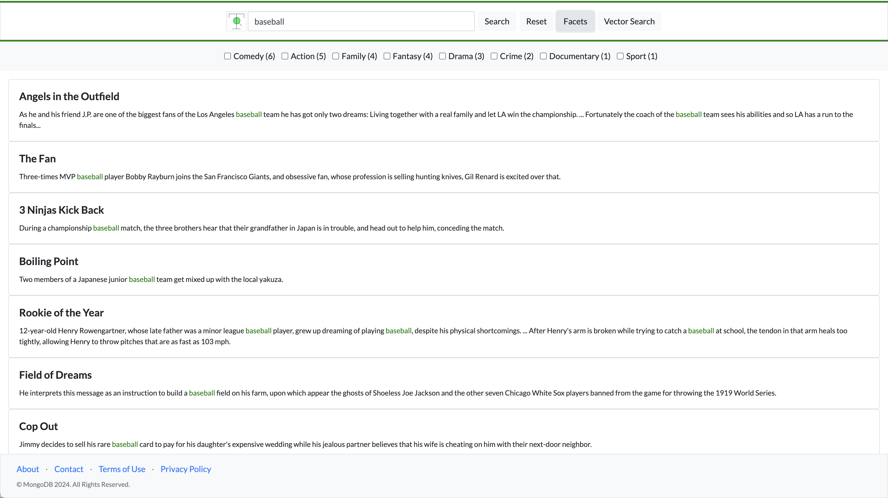

A simple, clean example of using Atlas Search within a node.js web application. Includes keyword search, highlighting, pagination, and facets. 



# Prerequisites

## Launch an Atlas Cluster with the Sample Datasetss

Atlas Search (and Vector Search) requires MongoDB Atlas. Launch a cluster and load the sample datasets, which includes the `sample_mflix` database and, within it, the `embedded_movies` collection. That collection has a `plot` field, which will be used to support standard text searches, and a `plot_embedding` field that supports vector search.

## Create the Search Indexes

The required search indexes can be created using the Atlas UI. Alternatively, you could use the Atlas Admin API, the Atlas CLI, Terraform, etc. (see [here](https://www.mongodb.com/docs/atlas/atlas-search/create-index/)). Create the following Atlas Search index on the `sample_mflix.embedded_movies` collection
(keeping 'default' as the Index Name):

```
{
  "mappings": {
    "dynamic": false,
    "fields": {
      "title": { "type": "string" },
      "fullplot": { "type": "string" },
      "genres": [ { "type": "string" }, { "type": "stringFacet" } ]
    }
  }
}
```

Note in the index definition that genres is declared as both "string" and "stringFacet".
"stringFacet" allows the application to identify the counts by genre for a given search,
while "string" enables the app to subsequently narrow the search to specific user-selected genres.


Create the following vector index on the `sample_mflix.embedded_movies` collection,
as documented in this [blog](https://www.mongodb.com/developer/products/atlas/semantic-search-mongodb-atlas-vector-search/). You can accept the default index name (`vector_index`), but be sure to specify this index name in your application code.

```
{
  "fields": [
    {
      "type": "vector",
      "path": "plot_embedding",
      "numDimensions": 1536,
      "similarity": "cosine"
    }
  ]
}
```

## (Optional) Procure an OpenAI Key

If you want to try Vector Search, you'll need an Open AI key. Although the embedded_movies collection already includes some plot vectors, you'll need a key to vectorize your search queries. If you don't have a key you can still run the demo - you just can't use vector search. 

# Running the Demo Application

The demo app is written in Node.js. Install Node.js, then install the demo dependencies ("npm install") as defined in the `package.json` file. Your Atlas cluster connect string and your Open AI key (if you're using one) can be passed in as environment parameters:

```
URI=<your-atlas-connect-string> OPENAI_KEY=<your-openAI-key> node index.js
```

