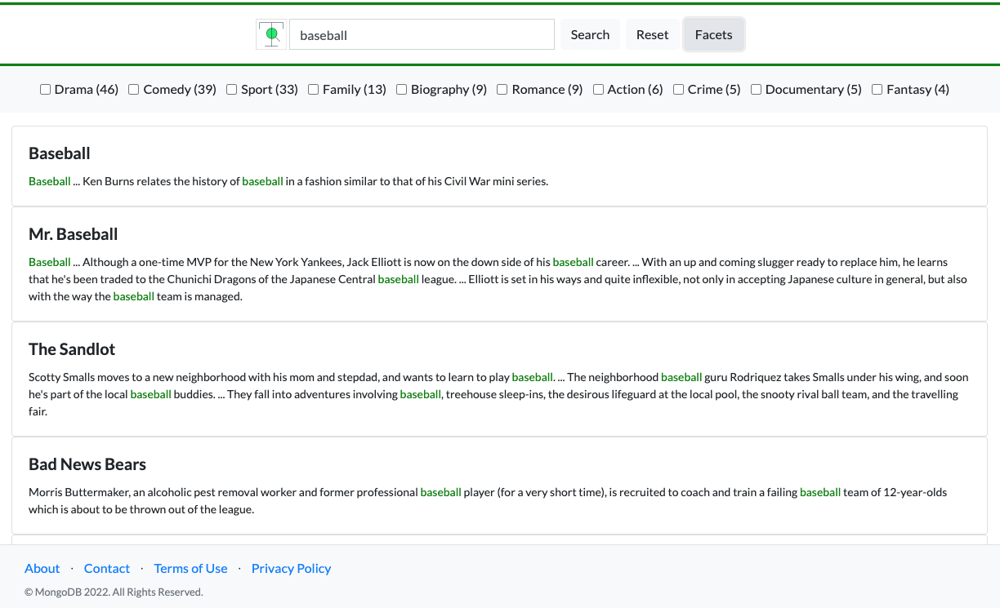

# Atlas Search

A simple and clean example of using Atlas Search within a node.js web application. Includes keyword search, highlighting, pagination, and facets. 

# Prerequisites

Search and Vector search requires MongoDB Atlas. Launch a cluster and load the sample datasets, which includes the sample_mflix database and, within it, the embedded_movies collection. That collection has a plot field, which will be used to support standard text searches, and the embedded_movies collection, which has a plot_embedding field that supports vector search. 

The required search indexes can be created using the Atlas UI. Alternatively, you could use the Atlas Admin API, the Atlas CLI, Terraform, etc. (see here:https://www.mongodb.com/docs/atlas/atlas-search/create-index/). 

Create the following Atlas Search index on the sample_mflix.embedded_movies collection
(keeping 'default' as the Index Name):
{
  "mappings": {
    "dynamic": false,
    "fields": {
      "title": { "type": "string" },
      "fullplot": { "type": "string" },
      "genres": [ { "type": "string" }, { "type": "stringFacet" } ]
    }
  }
}

Note in the index definition that genres is declared as both "string" and "stringFacet".
"stringFacet" allows the application to identify the counts by genre for a given search,
while "string" enables the app to subsequently narrow the search to any user-selected genres.

Use this to create a vector index on the sample_mflix.embedded_movies collection,
as documented in this blog:https://www.mongodb.com/developer/products/atlas/semantic-search-mongodb-atlas-vector-search/

Index Name: vector_index (default)
**IMPORTANT! The name of the vector index has to match what's specified in the search code.

Index JSON specification:

{
  "fields": [
    {
      "type": "vector",
      "path": "plot_embedding",
      "numDimensions": 1536,
      "similarity": "cosine"
    }
  ]
}

